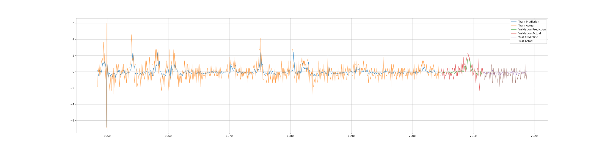
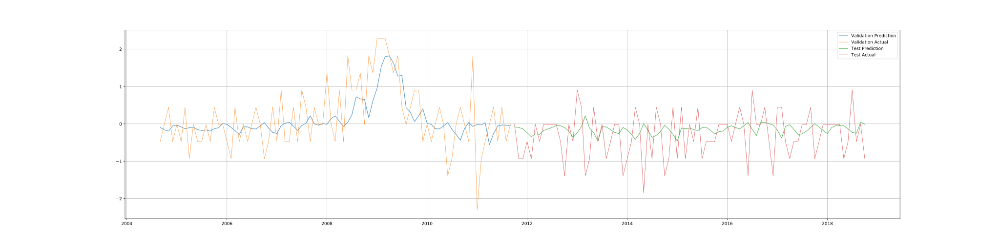

# ANNEF

> Artificial Neural Networks in Economic Forecasting

## About this Project

ANNEF is a project focusing on the interdisciplinary areas of economics, computer science, and statistics.

With recent advances in artificial neural networks, ANNs are shown to be excellent in image recognition and translation tasks. However, we found relatively rare work done on examining the power of artificial neural networks on time series tasks.

In this project, we aim to implement a wide range of models, both from structural and non-structural, to forecast various economic indicators, including unemployment and foreign exchange rates.

#### Documentation Site-map

* [The Project Methodology and Workflow](method.md)
* [A Demonstration with Dense Layer Only](./ts_dnn.html)
* [The Second Demonstration](demo2.md)
* [How to Train a Model](train.md)
* [How to Restore a Saved Model](restore.md)
* [Hyper-Parameter Tuning](hpt.md)
* [The Project Road Map](roadmap.md)
* [Notes on Datasets](data.md)
* [References](ref.md)
* [Test Link](./pset1.pdf)

## Project Directory Layout

#### Main Model

- `/core`  core files containing codes

**Note** for descriptions on other directories other than `core`, please refer to [layout description](layout.md).

## Packages

In this project, we chose `pandas` ,  `numpy` and `sklearn` packages to handle data pre-processing tasks. 

For neural networks in this project, we implemented them using `tensorflow` package. 

As well,  `tensorboard` library helps network graph and training visualization.

Statistical models from time series analysis are used a benchmarks in this project. 

Comparisons among neural networks and statistical models allow we to evaluate the forecasting performance, in terms accuracy, of those networks we built. 

Those models are implemented using `statsmodels` package.

## The First Demonstration

> **A Small Scale Neural Network on an Univariate Time Series**
>
> **Civilian Unemployment Rate**

> Config: LAGS=3-epochs=500-num_neurons=(64, 128, 256)-learning_rate=0.03

**Note** [The DNN demonstration](./ts_dnn.html) provides a more basic basic example with dense layers only.

In this first demonstration model, we trained a relatively small-scale neural network. 

The model is trained to forecast one step forward based on observations on the three previous steps (i.e., Lag = 3) of **Civilian Unemployment Rate** (UNRATE). (See [reference](ref.md) for more information on this dataset).

It consists of a multi-layer recurrent architecture of three layers of long-short-term-memory (LSTM), with 64, 128 and, 256 neurons in each layer respectively.

We trained this model using Adam Optimizer with a learning rate of 0.03 for 500 epochs. 

For validation and testing sets only, the model prediction gives the figure below

Also, the model predicts on both the training set and the validation set after every fifty epochs during the training session, and we have plotted them all together with the actual series.

As we shall see, this model only captures the correct direction of movement but could not predict the magnitudes of movements well. We believe this is mainly because of the short lags specified and it only takes a univariate time series. In our second demonstration, we will present another multi-layer LSTM model with more lags. 

Also, in future models, we are going to implement recurrent neural networks with multiple input sequences (context series). 

The figure below presents a detailed record on the evolving of the model.

