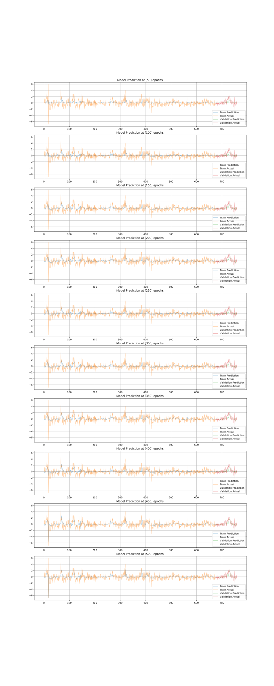

# ANNEF

> Artificial Neural Networks in Economic Forecasting

## About this Project

ANNEF is a project focusing on the interdisciplinary areas of economics, computer science, and statistics.

With recent advances in artificial neural networks, ANNs are shown to be excellent in image recognition and translation tasks. However, we found relatively rare work done on examining the power of artificial neural networks on time series tasks.

In this project, we aim to implement a wide range of models, both from structural and non-structural, to forecast various economic indicators, including unemployment and foreign exchange rates.

#### Documentation Sitemap

* [The Project Methodology and Workflow](method.md)

* [The Second Demonstration](demo2.md)

* [The Project Road Map](roadmap.md)

* [How to Train a Model](train.md)

* [How to Restore a Saved Model](restore.md)

* [Hyper-Parameter Tuning and Searching](hps.md)

* [A List of References](ref.md)

## Project Directory Layout

#### Main Model

- `/core`  core files containing codes
- `/data` dataset directory
- `/notebooks`  Jupyter notebooks
- `/saved_models`  this is the default directory for TensorFlow to store models after training.
- `/tensorboard`  this is the default directory for TensorFlow to store tensor board visualization files.

#### Archived Models

- `/keras_based`  models built on `keras`
- `/matlab_based`  models built on `MatLab` 

## Packages

In this project, we chose `pandas` ,  `numpy` and `sklearn` packages to handle data pre-processing tasks. 

For neural networks in this project, we implemented them using `tensorflow` package. 

As well,  `tensorboard` library helps network graph and training visualization.

Statistical models from time series analysis are used a benchmarks in this project. 

Comparisons among neural networks and statistical models allow we to evaluate the forecasting performance, in terms accuracy, of those networks we built. 

Those models are implemented using `statsmodels` package.

## The First Demonstration

> **A Small Scale Neural Network on an Univariate Time Series**

> Config: LAGS=3-epochs=500-num_neurons=(64, 128, 256)-learning_rate=0.03

We have run a hyper-parameter searching session with more than 500 configurations and chose one of the best performings regarding their mean-squared-error.

In this first demonstration model, we trained a relatively small-scale neural network. 

The model is trained to forecast one step forward based on observations on the three previous steps (i.e., Lag = 3)

It consists of a multi-layer recurrent architecture of three layers of long-short-term-memory (LSTM), with 64, 128 and, 256 neurons in each layer respectively.

We trained this model using Adam Optimizer with a learning rate of 0.03 for 500 epochs. The model predicts on both the training set and the validation set after every fifty epochs and we have plotted them all together with the actual series. (fig below)

And the figure below represents a zoomed-in picture on the final prediction (after 500 epochs)